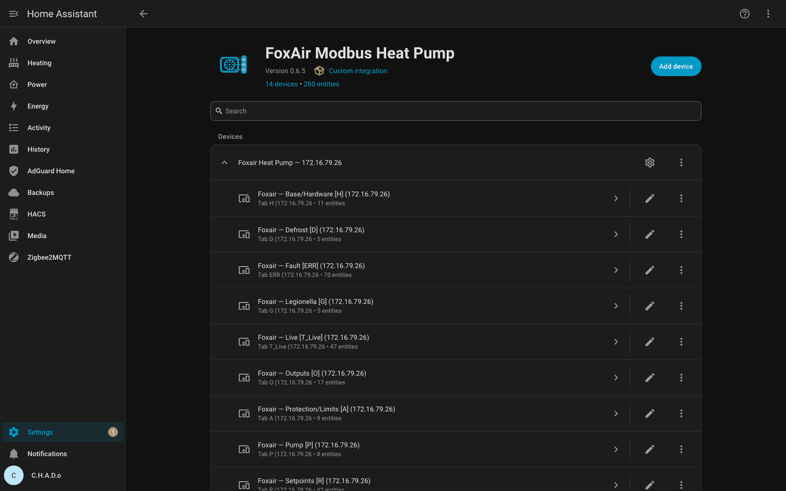

# FoxAir Modbus Heat Pump for Home Assistant

Control and monitor your **FoxAir / PHNIX air-to-water heat pump** directly from Home Assistant over Modbus TCP — no cloud, no YAML.

  



Register maps and scaling based on the reverse-engineering in [dosordie/FoxAir_Control](https://github.com/dosordie/FoxAir_Control).

## What you get

- **Live diagnostics** — inlet/outlet, coil, ambient, exhaust, pressures, flow, compressor freq, fan RPM, voltages
- **Controls** — heating / DHW / cooling setpoints, SG Ready, pump modes, zone mixing valves, climate **Off / Heat** with 4 DHW presets
- **Heating curve** — slope / offset / mode with a live panel and SVG graph — no Lovelace YAML
- **Computed sensors** — heating power, electrical power, COP from `flow·ΔT`
- **Multiple pumps** — configurable entity prefix so each unit gets its own IDs
- **Safety** — expert mode gates installer controls; writes are validated
- **i18n** — English, German, Russian, all with `CODE:` prefix

## How it works

Reads go through a single `pymodbus.AsyncModbusTcpClient` (the EW11 gateway allows only one TCP client) and a `FoxAirCoordinator` polling every 30 s. Entities read via shared metadata and write back with a fast 350 ms read-back. Each register carries `risk`, `requires_expert`, and `hidden` flags — hidden ones (system/reserved) are never created, polled, or written.

## Requirements

- Home Assistant **>= 2025.3**
- Python `pymodbus>=3.6.0`
- FoxAir/PHNIX on Modbus TCP (tested with an Elfins EW11 at the default `host:8899 slave 1`)

## Installation via HACS (recommended)

1. Make sure [HACS](https://hacs.xyz/docs/use/) is installed.
2. **HACS → Integrations → ⋯ → Custom repositories** → add `https://github.com/tnako/ha-foxair` as `Integration`.
3. Search **FoxAir** → **Install** → **Restart**.
4. **Settings → Devices & Services → Add Integration → FoxAir Heat Pump** → host / port / slave (defaults fill in automatically).

You get a **FoxAir Heat Pump** device with sub-devices per block (setpoints, diagnostics, pump, SG Ready, …). Safe controls are on by default; enable **Expert mode** in the options to reach installer controls.

## Manual installation

Copy `custom_components/foxair` to `/config/custom_components/foxair` (HAOS: `scp -r custom_components/foxair homeassistant@homeassistant.local:/usr/share/hassio/homeassistant/custom_components/`), then restart.

## Configuration

- **Options** (⋯ on the integration card): turn on **Expert mode** (+ ack) to expose advanced controls; pick an **Electrical power source for COP**
- **Entity prefix** — set when adding the integration so several pumps don't collide (default: `foxair`)
- **Climate** → `Off` / `Heat` + presets `Heating`, `Cooling`, `Heating+Hot Water`, `Cooling+Hot Water`
- **Heating curve** → Slope / Offset / Mode → live `sensor.foxair_heating_curve_target` + graph

## Help & diagnostics

Enable logging in `configuration.yaml`:
```yaml
logger:
  logs:
    custom_components.foxair: debug
    pymodbus: info
```

**Settings → Devices → FoxAir → Download diagnostics** shows host/port/slave, poll/error stats, and sample raw/value (no secrets).

More: [DEBUG.md](docs/DEBUG.md), [ROADMAP.md](docs/ROADMAP.md), [CHANGELOG.md](CHANGELOG.md).

## Development

- Generate metadata: `python3 tools/build_metadata.py`
- Generate vendor model: `python3 tools/gen_foxair_modbus.py`
- Sort / fix translations: `python3 tools/fix_translations.py`
- Validate: `python tools/validate.py`
- Audit registers: `python tools/check_regs.py` (set `HASS_URL`/`HASS_TOKEN` in `.env`; `--direct` for raw Modbus, `--codes H01,P02` to filter)
- Deploy: `tools/deploy.sh` (reads `HA_HOST` from `.env`)

## License

MIT — see [LICENSE](LICENSE)