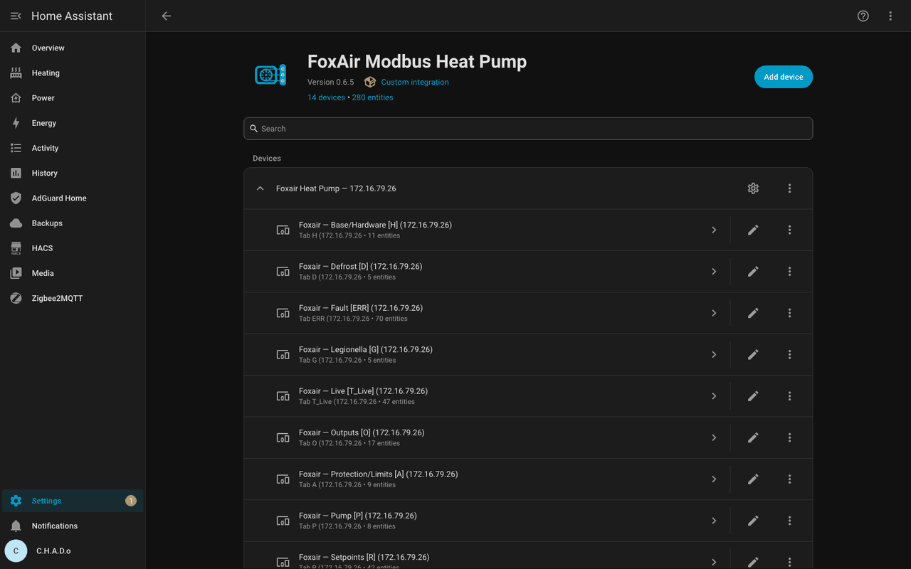

# FoxAir Modbus Heat Pump for Home Assistant

Control and monitor your **FoxAir / PHNIX air-to-water heat pump** directly from Home Assistant over Modbus TCP — no cloud, no YAML.

  



Register maps and scaling based on the reverse-engineering in [dosordie/FoxAir_Control](https://github.com/dosordie/FoxAir_Control).

## What you get

- **Live diagnostics** — inlet/outlet, coil, ambient, exhaust, pressures, flow, compressor freq, fan RPM, voltages
- **Controls** — heating / DHW / cooling setpoints, SG Ready, pump modes, zone mixing valves, climate **Off / Heat** with 4 DHW presets
- **Hot water** — `water_heater.foxair_dhw`: tank temperature (T08), target (R01) within the unit's R36/R37 limits
- **Fault alarm** — `binary_sensor.foxair_fault` (problem) is on while any documented fault bit is set; `active_faults` lists them
- **PV surplus** — `switch.foxair_pv_surplus` for EVCC or HA automations, see below
- **Runtime counters** — compressor runtime (2032, h) and compressor starts (2023, firmware 3.3+) as total counters, read from the unit
- **Heating curve** — slope / offset / mode with an SVG graph image entity — no Lovelace YAML
- **Firmware V3.5** — 7-point heating curve (H36 = 2, points 1250-1255 + 1235 as the 0 °C point, on the "Heating curve" device together with slope/offset; each shown only in the H36 mode that uses it), external outdoor sensor (1463 select, 2033 external / 2136 internal T04, 2048 effective), heating/summer cut-off (1464 threshold, 1465 delay in min, 2146 bit 4 active) and SG01 = AI Saving (1334 = 4); all created only when 2104 reports V3.5
- **Computed sensors** — heating power, electrical power, COP from `flow·ΔT`
- **Multiple pumps** — configurable entity prefix so each unit gets its own IDs
- **Safety** — expert mode gates installer controls; writes are validated
- **i18n** — English, German, Russian, all with `CODE:` prefix
- **Firmware-gated** — SG Ready modes 1/2 (SG01 / 1334), manual defrost / silent flag / manual heat (1016), and power-off-memory autostart (1018) are automatically hidden on devices running Firmware < 3.3 (auto-detected from register 2104) and appear when the firmware meets the gate

## How it works

Reads go through a single `pymodbus.AsyncModbusTcpClient` (the EW11 gateway allows only one TCP client) and a `FoxAirCoordinator` polling every 30 s. Entities read via shared metadata and write back with a fast 350 ms read-back. Each register carries `risk`, `requires_expert`, and `hidden` flags — hidden ones (system/reserved) are never created, polled, or written.

## Which temperature the thermostat shows (H25)

The climate entity follows the unit's own control settings, it never assumes outlet water:

| Setting | Climate current temperature | Climate target |
| --- | --- | --- |
| H25 = Outlet / Inlet / Buffer water | T02 / T01 / T07 | R02 heating, R03 cooling; the live curve target (2014) while heating with H36 = linear or 7-point curve |
| H25 = Room | T09 | R70 target room temperature |

With H36 = on the heating curve drives the target, so changing the thermostat target (for example with the +/- buttons) shifts the curve offset (1235) by the same amount. The slope stays unchanged, so the whole curve moves up or down. With the V3.5 7-point curve (H36 = 2) the same +/- moves all seven points by the same amount. The new target shows at once and is replaced by the device value (2014) once the unit has recalculated.

The climate attributes `control_source`, `current_addr` and `target_addr` show which registers are in use. If they disagree with H25, run `tools/check_regs.py` (the `CLIMATE:*` rows) and include its output plus a diagnostics download in the issue. The heating-curve image always plots the heating water side; its y-axis names the H25 sensor.

## Requirements

- Home Assistant **>= 2026.10**
- Python `pymodbus>=3.10.0`
- FoxAir/PHNIX on Modbus TCP (tested with an Elfins EW11 at the default `host:8899 slave 1`)

## Installation via HACS (recommended)

1. Make sure [HACS](https://hacs.xyz/docs/use/) is installed.
2. **HACS → Integrations → ⋯ → Custom repositories** → add `https://github.com/tnako/ha-foxair` as `Integration`.
3. Search **FoxAir** → **Install** → **Restart**.
4. **Settings → Devices & Services → Add Integration → FoxAir Heat Pump** → host / port / slave (defaults fill in automatically).

You get a **FoxAir Heat Pump** device with sub-devices per block (setpoints, diagnostics, pump, SG Ready, …). Safe controls are on by default; enable **Expert mode** in the options to reach installer controls.

## Manual installation

Copy `custom_components/foxair` to `/config/custom_components/foxair` (HAOS: `scp -r custom_components/foxair homeassistant@homeassistant.local:/usr/share/hassio/homeassistant/custom_components/`), then restart.

## Configuration

- **Options** (⋯ on the integration card): turn on **Expert mode** (+ ack) to expose advanced controls; pick an **Electrical power source for COP**
- **Entity prefix** — set when adding the integration so several pumps don't collide (default: `foxair`).
  Each pump needs its own entry with a unique prefix (`house1`, `cottage`) AND a different
  Modbus slave ID (1, 2, …). Devices render as `House1 Heat Pump (slave 2)` with
  sub-devices (`House1 — Setpoints [R] (slave 2)`), entities as `sensor.house1_1158`.
  Host/port/slave/prefix stay editable via ⋯ → Reconfigure (prefix change renames all
  entity IDs of that pump). Diagnostics show host/port/slave/prefix per entry.
- **Climate** → `Off` / `Heat` + presets `Heating`, `Cooling`, `Heating+Hot Water`, `Cooling+Hot Water`
- **Heating curve** → Slope / Offset / Mode → live `sensor.foxair_heating_curve_target` + graph
- **PV surplus** → `switch.foxair_pv_surplus` (firmware 3.3+): on = SG Ready mode 4 High PV, off = mode 2 normal, written to the virtual SG input 8801. Needs **SG01 = Modbus / virtual SG input** (1334 = 3), no SG contacts wired. In EVCC use the *Home Assistant switch* charger with this entity. The unit applies a new SG mode at most every 10 minutes: the switch shows the request at once, `sensor.foxair_sgstatus` shows the mode the unit accepted. Mode 4 behaviour (setpoint raise, power) is set in the SG block (SG03-SG08)

## Efficiency analyser (settings tuning, testing)

The "Efficiency" sub-device compares heating efficiency between settings, so a
change can be judged even though the weather never repeats. Tracked settings:
EEV (E01-E19, E03-1 to E07-5), fan (F05, F06, F19, F26), water pump (P01-P03,
P11, P12, A40), compressor (C02, C03, C10), defrost (D01-D03, D17, D19) and
heaters (A31, A33, A34, H18). Any change to one of them, from the unit, the app
or HA, starts a new comparison group and is logged.

- Every 30 s poll feeds a 10-minute bucket: heating only, compressor running
  for at least 10 minutes, no defrost, no electric heater, and no settings
  change inside the bucket. A bucket needs 6 minutes of such steady polls, so
  a compressor stop or start inside it does not drop it (short mild-weather
  runs still count). Each bucket stores compressor Hz, outdoor and flow
  temperature, heat and electrical power, suction superheat and EEV steps.
- The model is COP = eta x Carnot COP(flow, outdoor), with eta fitted on Hz and
  outdoor temperature from the baseline settings' buckets only. It needs about
  6 hours of steady running over 2 days before it predicts. On real data it
  predicted a held-out day with about 6 % average error.
- `Efficiency index`: COP of the last 24 h as % of what the baseline would have
  done in the same weather and load. 100 % = same as the baseline.
- `Expected COP`: what the baseline would give right now, next to the measured COP.
- `EEV settings group`: `baseline`, or the parameters that differ from it.
  Attributes list the full settings and that group's result.
- `Finding`: short cycling, superheat off its E02 target, or COP falling as
  superheat rises.
- `Daily COP`: heat out / electricity in for the last full day, including
  defrost, cycling, hot water and standby. Days need 80 % data coverage, 5 kWh
  of heat and 1 h of running. Settings that act outside steady running
  (defrost, pump, compressor limits, heaters) are judged on this daily score
  against a day model (outdoor temperature, run hours), with a 5-day minimum.
- `Defrosts (24 h)`: count, plus duration, heating time before, interval,
  electricity, outdoor and coil temperature of each recent defrost.
- `Set EEV baseline` button: makes the current settings the reference.
- `Next step`: what to do now, with a `message` attribute such as "Change E02
  from 3.5 to 4.0, then keep it for at least 3 heating days":
  - `collecting`: the baseline needs N more heating days;
  - `change`: one step on one parameter, in this order:
    - E02 in 0.5 K steps (2-6 K), direction from how COP vs the model moves
      with measured superheat, or superheat vs its target;
    - F05 in 2 K steps (-10 to 2 °C), slower fan first (lower F05 = less fan
      speed at the same coil temperature), then the other direction; only
      when the fan is not at its maximum and the median outdoor temperature
      of the last 7 days is at least 3 °C;
    - D03 +15 min (30-90), only when most recent defrosts are short (under
      4 min) and start right after the D03 minimum, judged on the daily score.
    Only the settings listed above are ever suggested. Every other tracked
    setting is watch-only: changes to it are recorded and compared, never
    proposed. Findings such as `fan_at_max` are reported only.
  - `keep`: wait, either 24 h after any change or until the test group has 3 days;
  - `revert` / `accept`: the test is worse, better, or showed no clear gain
    after 10 days;
  - `wait_heating`: under about 1 h of steady heating in the last 2 days;
  - `check_curve`: short cycling, so fix the curve or hysteresis first;
  - `done`: no parameter has a test worth running right now.
  A step that tested worse or inconclusive isn't suggested again; the other
  direction is tried instead.
- `Next decision`: when the analyser decides next (end of the 24 h hold after a
  change, or today + the missing heating days with attribute `estimated: true`).
  It is never in the past: while a suggestion waits for you it is unknown, and
  `Finding` shows `action_suggested` unless there is a real issue.
- Every EEV change, whoever made it, is logged with time and old/new values
  (last 10 in the `changes` attribute of `Next step`). A "Set EEV baseline"
  press is logged as a baseline event.

The suggestion is a test to run, not a promise: superheat follows load and
weather, so only the A/B result proves a gain.

How to test a change:
1. Run the current settings until `Next step` says `change` (3+ heating days).
2. Make exactly that change on the unit, in the app or in HA (expert mode). The
   analyser picks it up within 10 minutes. Reading the settings needs no expert mode.
3. Leave it while `Next step` says `keep`. Then follow `revert` or `accept`
   (accept = keep the value and press "Set EEV baseline").

COP needs a heat value: T59 (firmware 3.3+) or flow x delta T. For the electrical
side, set Options -> Electrical power source = external meter if you have one.
History is stored in `.storage/foxair.efficiency.<entry id>` and survives restarts.

### Assist / MCP

The integration adds a read-only LLM tool, `foxair__GetEfficiencyReport`, to the
Assist API. It returns one report per heat pump (optional `unit` argument: name
prefix, title or Modbus slave id): live readings, the next step, findings, COP
per settings group, the last qualifying day, recent setting changes and the
suggestion policy (which settings the advisor may propose, with step and range,
and which it only watches). It is offered only when a Foxair climate entity is
exposed to Assist, and it never writes to the pump. With the Model Context
Protocol Server integration, MCP clients get it at
`http://<ha>:8123/api/mcp/assist`. A non-admin user marked "local network only"
is enough.

## Help & diagnostics

Enable logging in `configuration.yaml`:
```yaml
logger:
  logs:
    custom_components.foxair: debug
    pymodbus: info
```

**Settings → Devices → FoxAir → Download diagnostics** shows host/port/slave, poll/error stats, and sample raw/value (no secrets).

More: [DEBUG.md](docs/DEBUG.md), [ROADMAP.md](docs/ROADMAP.md), [FACTORY_DEFAULTS.md](docs/FACTORY_DEFAULTS.md) (factory values per model and how to compare), [CHANGELOG.md](CHANGELOG.md).

## Development

- Generate metadata: `python3 tools/build_metadata.py`
- Sort / fix translations: `python3 tools/fix_translations.py`
- Validate: `python tools/validate.py`
- Audit registers: `python tools/check_regs.py` (set `HASS_URL`/`HASS_TOKEN` in `.env`; `--direct` for raw Modbus, `--codes H01,P02` to filter)
- Deploy: `tools/deploy.sh` (reads `HA_HOST` from `.env`)

## License

MIT — see [LICENSE](LICENSE)